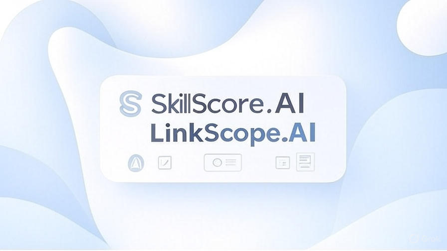

  

<h1 align="center" style="color:#0B5394;">Tech Track Decoded | AI-ML Track</h1>

  <i>This repository features two hands-on, real-world AI-driven applications built using Python</i>

## 📦 Project 1: SkillScore.AI (Built with Streamlit)

### 🎯 Goal
A smart and simple **skill assessment and roadmap generator** designed for students to self-evaluate their technical competencies and get a personalized learning roadmap — all within the Python ecosystem using Streamlit.

### 🧰 Features
- Interactive form for entering known skills and confidence levels
- Smart scoring system to evaluate readiness for career paths like Web Dev, Data Science, DevOps, etc.
- Dynamic roadmap and suggestions based on inputs
- Visualization of skill scores using radar or bar charts
- Option to download a personalized PDF roadmap
- Fully deployable via Streamlit Cloud

### 🧠 Key Technologies
- Streamlit – Python web framework for building interactive apps quickly
- Plotly / Matplotlib – For generating dynamic visualizations like radar and bar charts
- Pandas – Used to process user inputs and apply scoring logic on skillsets
- Custom Python Logic – For evaluating skill depth and generating roadmaps
- PDFKit or ReportLab – To generate downloadable personalized learning roadmaps in PDF format
- Streamlit Cloud – For quick deployment and sharing of the app with users

### 💡 Learning Outcomes
- Introduction to Streamlit UI elements (forms, sliders, checkboxes)
- Logic building for recommendations
- Visualizations with Python libraries like Plotly or Matplotlib
- PDF export capability
- End-to-end deployment and hosting

---

## 📦 Project 2: LinkScope.AI (Built with Flask + Ollama)

### 🎯 Goal
A **LinkedIn Profile Analyzer** powered by a locally hosted LLM (via [Ollama](https://ollama.com/)). The app allows users to upload their exported LinkedIn profile PDF and receive an AI-generated feedback report, including strengths, weaknesses, and suggestions to enhance their public professional presence.

### 🧰 Features
- Upload and parse LinkedIn profile PDFs (exported directly from LinkedIn)
- Extract relevant sections: Summary, Experience, Skills, Education
- Send parsed data to a local LLM via Ollama’s API
- Get smart analysis in clean markdown (converted to HTML)
- Display:
  - Profile Strengths
  - Weaknesses
  - Suggested Summary Rewrite
  - Top 3-5 Career Enhancement Tips
- Downloadable PDF improvement report
- Fully local setup — no external LLM APIs required

### 🧠 Key Technologies
- Flask – Python web framework for routing, templating, and handling file uploads
- PyMuPDF or pdfminer.six – For extracting clean text from exported LinkedIn PDF files
- Ollama LLM – Runs local open-source language models like LLaMA 3, Mistral, DeepSeek, or Gemma for analysis
- Markdown Rendering – To convert AI-generated markdown into styled HTML within the app
- PDFKit or ReportLab – To generate downloadable improvement reports in PDF format

### 💡 Learning Outcomes
- Flask project structure and route handling
- File upload handling and PDF parsing
- Local LLM integration using HTTP APIs
- Templating with Jinja2
- Markdown-to-HTML conversion
- PDF export from dynamic content
- Deployment on local or cloud infrastructure

---

## ✨ Bonus Highlights

| Feature | SkillScore.AI (Streamlit) | LinkScope.AI (Flask + Ollama) |
|--------|----------------------------|-------------------------------|
| Stack | Streamlit, Plotly, Python | Flask, Ollama, PyMuPDF |
| Input | Manual (skills, confidence) | PDF upload (LinkedIn export) |
| Output | Roadmap, skill graph, PDF | AI-generated feedback, PDF report |
| Deployment | Streamlit Cloud | Localhost / HuggingFace Spaces |
| LLM Use | ❌ None | ✅ Ollama (local LLM) |
| Offline Friendly | ✅ Fully | ✅ Fully (runs on local LLM) |

---

## 📬 Contact

Feel free to reach out or connect on [LinkedIn](https://linkedin.com/in/arhmnajs) if you'd like feedback, collaboration, or mentorship in building AI-powered tools using Python.
